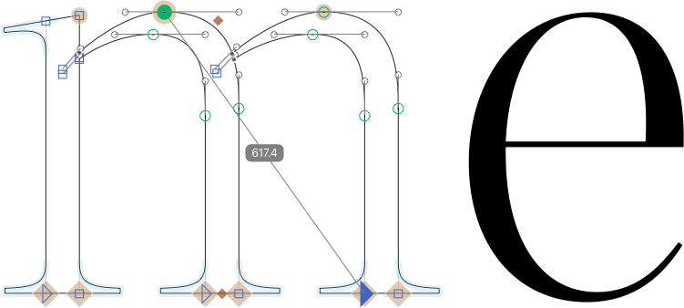

# ShowDistanceBetweenTwoPoints.glyphsReporter

This is a plugin for the [Glyphs font editor](http://glyphsapp.com/) by Georg Seifert.
It displays the distance between two selected nodes when exactly two points are selected, ignoring intersections in between.
After installation, it will add the menu item *View > Show Distance between Two Points* (German: *Abstand zwischen zwei Punkten anzeigen*, French: *Afficher distance entre deux points*).
You can set a keyboard shortcut in System Preferences.

### Installation

1. Download the complete ZIP file and unpack it, or clone the repository.
2. Double click the .glyphsReporter file. Confirm the dialog that appears in Glyphs.
3. Restart Glyphs.

### Usage Instructions

1. Open a glyph in Edit view.
2. Use *View > Show Distance between Two Points*.
3. Select exactly two points (on-curve or off-curve).

### Requirements

The plugin needs Glyphs 2.3 or higher, running on OS X 10.9.1 or later. I can only test it in current OS versions, and I assume it will not work in prior versions.

### License

Copyright 2016 Rainer Erich Scheichelbauer (@mekkablue).
Including sample code by Georg Seifert (@schriftgestalt) and Jan Gerner (@yanone).

Licensed under the Apache License, Version 2.0 (the "License");
you may not use this file except in compliance with the License.
You may obtain a copy of the License at

http://www.apache.org/licenses/LICENSE-2.0

See the License file included in this repository for further details.
